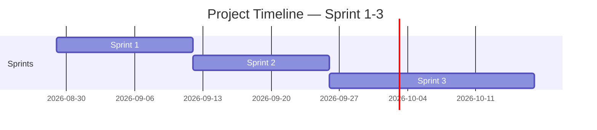

<!-- Template เต็มไฟล์สำหรับสร้าง docs/agile/02-sprint-backlog.md -->

<!-- ภาพรวมว่า Story ไหนไปอยู่ Sprint ไหนตลอด 4 Sprint — ไม่ต้องระบุคนรับผิดชอบ/Status ที่นี่ ส่วนนั้นอยู่ใน sprint-plan-[NN].md ของ Sprint ที่กำลังทำ -->

# Sprint Backlog

**Version:** 1.0 | **Last Updated:** 2026-09-01

> ภาพรวมว่า User Story ไหนจาก `01-product-backlog.md` จะไปอยู่ Sprint ไหน — Sprint ที่ยังไม่ถึงคือ draft คร่าวๆ ปรับได้เสมอเมื่อเข้าใจงานมากขึ้น

## Timeline (4 Sprint, Sprint ละ 2 สัปดาห์)

| Sprint   | เริ่ม | สิ้นสุด |
| -------- | ---------- | -------------- |
| Sprint 1 | 2026-08-29 | 2026-09-12     |
| Sprint 2 | 2026-09-13 | 2026-09-26     |
| Sprint 3 | 2026-09-27 | 2026-10-17     |

> ปรับวันที่ให้ตรงกับวันที่ทีมเริ่มลงมือทำจริง (ถ้าไม่ใช่วันแลปนี้)

## Team Capacity (ต่อ 2 สัปดาห์ 1 Sprint)

|           ชื่อ           | Capacity (hrs/Sprint) |
| :--------------------------: | :-------------------: |
|      เตชินท์ 116      |          106          |
|    ธีนันทนัช 120    |          128          |
|     นาถวัฒน์ 125     |          100          |
|     พรภวิษย์ 132     |          90          |
| **รวมเฉลี่ย** |     **106**     |

## Sprint 1 (กำลังทำ)

| # | User Story                                                                                                              | MoSCoW      | Estimate (SP) |
| - | ----------------------------------------------------------------------------------------------------------------------- | ----------- | ------------- |
| 1 | As a player, I want to be able to move, so that I can explore the map and do objectives.                                | Must Have   | 1             |
| 2 | As a player, I want to be able to interact with other stuffs, so that I can finish my objectives or hide from monsters. | Must Have   | 2             |
| 3 | As a player, I want entities to chase me, so that I feel challenged.                                                    | Must Have   | 2             |
| 4 | As a designer, I want fully mapped out levels, so that the players can explores and do objectives                       | Must Have   | 3             |
| 5 | As phobias, I want to have many variants, so that I can challenge the player in different ways.                         | Must Have   | 6             |
| 6 | As a developer, I want to have a menu and settings, so that the players can customize their experience to their liking. | Should Have | 3             |
| 7 | As a designer, I want the game to have audio and sound effects, so that the game becomes more immersive.                | Should Have | 2             |
| 8 | As a Artist, I want to redesign the main charecter to make them look more paranoid.                                     | Must Have   | 5             |
|   |                                                                                                                         |             |               |

## Sprint 2 (Draft)

| # | User Story                                                                                           | MoSCoW      | Estimate (SP) |
| - | ---------------------------------------------------------------------------------------------------- | ----------- | ------------- |
| 1 | As a player, I want to see my remaining lives                                                        | Should Have | 2             |
| 2 | As a Artist, I want to redesign some of the assets to make them clearer and batter guide the player. | Must Have   | 3             |

## Sprint 3 (Draft)

| # | User Story                                                                        | MoSCoW      | Estimate (SP) |
| - | --------------------------------------------------------------------------------- | ----------- | ------------- |
| 1 | [User Story ที่วางแผนไว้ล่วงหน้าจาก 01-product-backlog.md] | Should Have | [SP]          |
| 3 | As a Artist, I want draw the assets and phobisd that have been added.             | Must Have   | 5             |
| 4 | As a Artist, I want redesign the mini-game UI to make it look better.            | Should Have | 3             |

> **Sprint 2-3 คือ draft ระดับ release plan** — เป้าหมายคือฝึกกะจำนวน SP ต่อ Sprint ให้ใกล้เคียง capacity ของทีม ไม่ใช่ล็อก scope ตายตัว ปรับได้ทุกครั้งที่ทำ Sprint Planning ของ Sprint ถัดไป

> เมื่อ Sprint ไหนเริ่มทำงานจริง ให้คัดลอก template `sprint-plan-template.md` (ไฟล์แนบใน LMS) ไปสร้าง `docs/agile/sprint-plan-[NN].md` แล้วดึง Story ของ Sprint นั้นจากตารางด้านบนมาใส่คนรับผิดชอบ แตก Task และปรับ Estimate ให้ละเอียดขึ้น

## Links

- [[docs/agile/01-product-backlog|Product Backlog]]
- [[docs/agile/sprint-plan-01|Sprint 1 Plan]]
