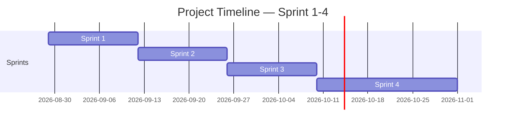

# Sprint Backlog

**Version:** 1.0 | **Last Updated:** 2026-09-01

## Timeline (4 Sprint, Sprint ละ 2 สัปดาห์)

| Sprint   | เริ่ม | สิ้นสุด |
| -------- | ---------- | -------------- |
| Sprint 1 | 2026-08-29 | 2026-09-12     |
| Sprint 2 | 2026-09-13 | 2026-09-26     |
| Sprint 3 | 2026-09-27 | 2026-10-10     |
| Sprint 4 | 2026-10-11 | 2026-11-02     |

```mermaid
gantt
    title Project Timeline — Sprint 1-4
    dateFormat  YYYY-MM-DD
    section Sprints
    Sprint 1 :s1, 2026-08-29, 14d
    Sprint 2 :s2, after s1, 14d
    Sprint 3 :s3, after s2, 14d
    Sprint 4 :s4, after s3, 22d

```

## Team Capacity (ต่อ 2 สัปดาห์ 1 Sprint)

|           ชื่อ           | Capacity (hrs/Sprint) |
| :--------------------------: | :-------------------: |
|      เตชินท์ 116      |          84          |
|    ธีนันทนัช 120    |          128          |
|     นาถวัฒน์ 125     |          100          |
|     พรภวิษย์ 132     |          90          |
| **รวมเฉลี่ย** |     **106**     |

## Sprint 1 (Draft)

| # | User Story                                                                                                                               | MoSCoW      | Estimate (SP) |
| - | ---------------------------------------------------------------------------------------------------------------------------------------- | ----------- | ------------- |
| 1 | As a player, I want to be able to move, so that I can explore the map and do objectives.                                                 | Must Have   | 1             |
| 2 | As a player, I want to be able to interact with other stuffs, so that I can finish my objectives or hide from monsters.                  | Must Have   | 2             |
| 3 | As a player, I want entities to chase me, so that I feel challenged.                                                                     | Must Have   | 2             |
| 4 | As a designer, I want fully mapped out levels, so that the players can explores and do objectives.                                       | Must Have   | 3             |
| 5 | As phobias, I want to have many variants, so that I can challenge the player in different ways.                                          | Must Have   | 6             |
| 6 | As a developer, I want to have a menu and settings, so that the players can customize their experience to their liking.                  | Should Have | 3             |
| 7 | As a designer, I want the game to have audio and sound effects, so that the game becomes more immersive.                                 | Should Have | 2             |
| 8 | As a designer, I want to make audio becomes stereo, so that the game gets even more immersive, and can also be a nice gameplay mechanic. | Should Have | 3             |
| 9 | As an artist, I want to redesign the main charecter to make them look more paranoid.                                                     | Must Have   | 5             |

## Sprint 2 (Draft)

| # | User Story                                                                                                              | MoSCoW      | Estimate (SP) |
| - | ----------------------------------------------------------------------------------------------------------------------- | ----------- | ------------- |
| 1 | As a player, I want to see my remaining lives.                                                                          | Should Have | 2             |
| 2 | As an artist, I want to redesign some of the assets to make them clearer and batter guide the player.                   | Must Have   | 3             |
| 3 | As a designer, i want to test out lightings so that the games feel more immersive.                                      | Must Have   | 2             |
| 4 | As a designer, I want fully mapped out levels, so that the players can explores and do objectives.                      | Must Have   | 3             |
| 5 | As phobias, I want to have many variants, so that I can challenge the player in different ways.                         | Must Have   | 6             |
| 6 | As a developer, I want to have a menu and settings, so that the players can customize their experience to their liking. | Should Have | 3             |

## Sprint 3 (Draft)

| # | User Story                                                                        | MoSCoW      | Estimate (SP) |
| - | --------------------------------------------------------------------------------- | ----------- | ------------- |
| 1 | [User Story ที่วางแผนไว้ล่วงหน้าจาก 01-product-backlog.md] | Should Have | [SP]          |
| 3 | As an artist, I want draw the assets and phobias that have been added.           | Must Have   | 5             |
| 4 | As an artist, I want redesign the mini-game UI to make it look better.           | Should Have | 3             |

## Sprint 4 (Draft)

| # | User Story | MoSCoW | Estimate (SP) |
| - | ---------- | ------ | ------------- |
| 1 |            |        |               |

## Links

- [[docs/agile/01-product-backlog|Product Backlog]]
- [[docs/agile/sprint-plan-01|Sprint 1 Plan]]
